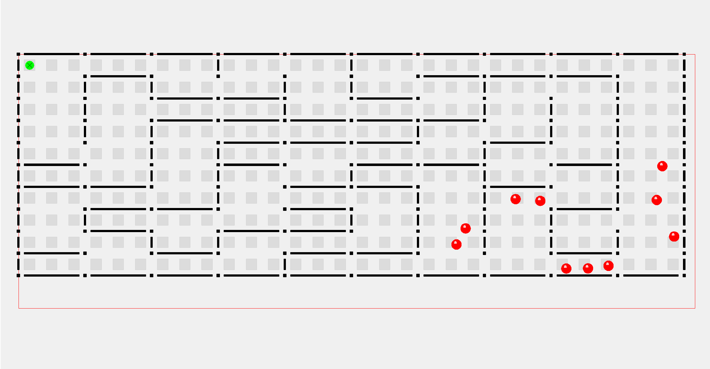

[](https://app.netlify.com/projects/breaking-walls/deploys)

# Breaking Walls

Game with rigid-body physics action in a 2D setting. Balls fly, bounce against walls, and break free towards other players.



Deployed on [Netlify](https://breaking-walls.netlify.app/) - distributed securely using `netlify.toml`:
```toml
[[headers]]
  for = "/*"
  [headers.values]
    Cross-Origin-Opener-Policy = "same-origin"
    Cross-Origin-Embedder-Policy = "require-corp"
```

## Build and Run

JavaScript glue code and files are generated using [Emscripten](https://emscripten.org/index.html).

In order to spin up the frontend with [Vite](https://vitejs.dev/), the WebAssembly modules must be compiled:
1. Generate JavaScript and WebAssembly files from [MazeBuilder's C++ codebase](https://github.com/zmertens/MazeBuilder). This is done with Emscripten and CMake.
   - Please note that there are different performances and compiler optimizations between the Release and Debug build configurations.
2. Move these generated files from the C++ repo to this repo:
     - `mazebuilderphysics.js` under `src/`
    - `mazebuilderphysics.wasm` under `src/`
    - `mazebuilderphysics.data` under `/public`
    
3. From the root of this repo, run `npm i` and then `npm run dev` , this will cause Vite to spin up a local server.
     - Open a browser with the specified port. For example, `localhost:5173`
